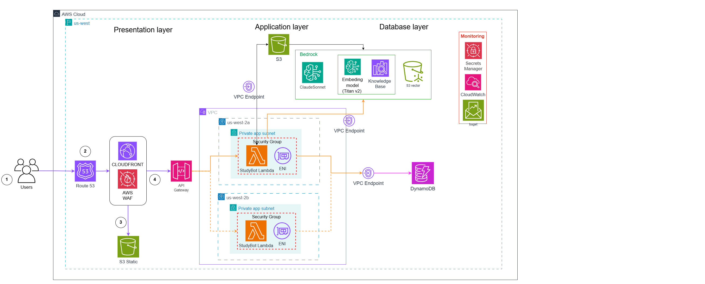

# W7 Capstone Evidence Pack — Group 8

---

## Table of Contents

| Section                                                                                         | Maps to W7 grading |
| ----------------------------------------------------------------------------------------------- | ------------------ |
| [1](#1-w7-requirements-summary) W7 Requirements Summary                                         | Crit II/IV         |
| [2](#2-cover) Cover                                                                             | Crit IV — context  |
| [3](#3-pitch--vision) Pitch & Vision                                                            | Crit I (10%)       |
| [4](#4-architecture) Architecture (7 mandatory + 1 optional)                                    | Crit II (20%)      |
| [5](#5-evidence-by-service-config) Evidence by Service Config                                   | Crit II/IV         |
| [6](#6-cost-discipline) Cost Discipline (3 daily screenshots)                                   | Crit IV            |
| [7](#7-security) Security (IAM baseline + Optional #10 area)                                    | Crit II/IV         |
| [8](#8-monitoring) Monitoring (Optional #8 partial: dashboard + alarm + custom metrics)          | Crit II/IV         |
| [9](#9-measurement--decisions--anti-đối-phó--required) Measurement & Decisions — anti-đối phó   | Crit II/III/IV     |
| [10](#10-lessons-learned-200-words) Lessons Learned (~200 words)                                | Crit IV            |
| [11](#11-teardown-plan) Teardown Plan + Mon 2/6 verify checklist                                | Crit IV            |

---

## Status Summary (at a glance for grader)

| Component                                | Status                                                            | Where in this doc |
| ---------------------------------------- | ----------------------------------------------------------------- | ----------------- |
| 7 Mandatory capabilities — all live      | Done                                                              | §4 table          |
| Live HTTPS URL                           | Done: `https://d2ejfy6ejo0y9l.cloudfront.net`                     | §2                |
| Real Bedrock invocation (not stub)       | Done: Claude Sonnet 4.5 + KB `11AOIXNNUM` ACTIVE                  | §4 + §9 D2        |
| Persistent state cross-session           | Done: DynamoDB `studybot-prod-users`                              | §4 + §9 D2        |
| Network isolation (DB not public-facing) | Done: VPC + private subnets, no NAT                               | §4 + §9 D3        |
| IAM least-privilege                      | Done: scoped S3/DDB ARNs; Bedrock resource wildcard documented    | §5 (Hình 18-21)   |
| Pre-flight Budget alert                  | Done: $80 confirmed                                               | §7                |
| Optional #8 Full Observability           | Partial: 3/4 (dashboard + alarm + custom EMF metrics; no saved Log Insights query) | §8                |
| Optional #10 Advanced Security           | Not implemented (would be KMS CMK)                                | §7                |
| §9 Decision blocks                       | Done: 3 blocks (W7 requires ≥2)                                   | §9                |
| Cost ≤ $30 (Bonus H eligibility)         | Expected, verify Friday                                           | §6                |
| 3 daily Cost Explorer screenshots        | Pending (Wed/Thu captured? Fri pending)                           | §6                |
| 5 security/monitoring screenshots        | Done: Images are available                                        | §5                |
| Architecture diagram PNG                 | Done: Included in section 4                                       | §4                |
| Teardown confirmation (Mon 2/6)          | Pending Sun to Mon                                                | §11               |

---

## 1. W7 Requirements Summary

### Mandatory capabilities (must demo 7/7)

- Public HTTPS URL (UI entry)
- Application compute (backend processing)
- AI/ML feature end-to-end (Bedrock InvokeModel or KB/Agent)
- Data persistence across sessions
- Object storage (S3)
- Network isolation (DB not public)
- IAM least-privilege for all services

### Optional capability (pick one, partial credit allowed)

- Full Observability or Advanced Cost Insights or Advanced Security

### Pre-flight safety (required before paid deploy)

- MFA on root
- Budget alert at $80 with confirmed SNS subscription
- Cost Anomaly Detection enabled
- Tag every resource: Project=W7Capstone, Team=G<N>, Owner=<name>, Environment=hackathon
- Bedrock model access enabled

### Required deliverables (by Fri 09:00)

- Live public URL (HTTPS)
- Public GitHub repo with setup + architecture + teardown instructions
- Architecture diagram that matches deployed resources
- Evidence Pack (this file) with screenshots and decisions
- Demo video (3 min) and slides (12-18 pages)

---

## 2. Cover

|                                  |                                                           |
| -------------------------------- | --------------------------------------------------------- |
| **Team**                         | G8                                                        |
| **Members**                      | [TBD — fill 8 names + Owner tag each]                     |
| **Domain**                       | A — EduTech (AI Study Buddy)                              |
| **App name**                     | StudyBot                                                  |
| **Repo**                         | [TBD repo URL]                                            |
| **Live URL**                     | https://d2ejfy6ejo0y9l.cloudfront.net                     |
| **API endpoint**                 | https://pyzr1w8hi2.execute-api.us-east-1.amazonaws.com    |
| **AWS account**                  | 273265662366                                              |
| **Region**                       | us-east-1                                                 |
| **Total spend (Friday morning)** | $[TBD — check Cost Explorer filtered by Project=studybot] |

---

## 3. Pitch & Vision

### Use case (3-sentence pitch)

University students drop a 40-slide lecture PDF into StudyBot and within 30 seconds
receive a 1-page summary of the 5 most testable concepts, a deck of flashcards, and
a 10-question MCQ quiz — every answer cited back to the specific slide it came from.
The same Q&A primitive that powers grounded note-taking also lets the student ask
"how does X relate to Y?" and get an answer that quotes the source instead of
hallucinating. We cut the 30-90 minutes of "make my own flashcards from this deck"
busywork to zero.

### Target user

University students cramming for exams. Self-learners working through technical
docs. Anyone who's ever lost a Sunday to making flashcards from a slide deck.

### Real-world parallels

- **Quizlet AI** — flashcards + adaptive quiz, but Quizlet builds its content from a
  pre-curated library; StudyBot RAGs from notes the student already owns.
- **Khanmigo (Khan Academy)** — Q&A tutor with citation, our `/query` endpoint
  serves the same intent for a student's own uploaded notes.
- **Google NotebookLM** — closest architectural analog: RAG over user-uploaded
  documents, with response grounding and chunk citation. We borrow the same
  product surface (upload → summarize → ask) and re-implement on AWS-native services.

### Why this domain matters

Education is the most universally relatable user story — every interviewer was once
a student. Architecturally, "Q&A with citations over user-uploaded documents" is
the same primitive that powers internal-docs assistants, customer-support bots, and
legal research tools — so the work transfers.

---

## 4. Architecture

<p align="center">
  
  <br/>
  <em>Hình 1: Final architecture diagram (pending draw.io export)</em>
</p>

### 7 mandatory capabilities — service mapping

| #   | Capability                   | Service in this stack                                                                                                                                                             | Rationale (one line)                                                                       |
| --- | ---------------------------- | --------------------------------------------------------------------------------------------------------------------------------------------------------------------------------- | ------------------------------------------------------------------------------------------ |
| 1   | UI Entry                     | **CloudFront** (`d2ejfy6ejo0y9l.cloudfront.net`) + **API Gateway v2 HTTP API** (`pyzr1w8hi2`)                                                                                     | HTTPS free on `*.cloudfront.net`, no cert lifecycle; cheapest API entry                    |
| 2   | Application Compute          | **Lambda Python 3.12** + Mangum adapter for FastAPI (`studybot-prod-api`)                                                                                                         | Pay-per-use, 1M req/month free tier covers hackathon                                       |
| 3   | AI / ML Feature              | **Bedrock Knowledge Base** (`11AOIXNNUM`) + **Claude Sonnet 4.5** via cross-region inference profile (`us.anthropic.claude-sonnet-4-5-20250929-v1:0`)                             | Grounded RAG with citation; Sonnet 4.5 over Haiku justified by measurement (§9 Decision 2) |
| 4   | Data Persistence             | **DynamoDB on-demand** (`studybot-prod-users`), single-table — `PK=user_id`, `SK=DOC#/QUERY#/FLASHCARD#/QUIZ#`                                                                    | All access is single-key by user; no JOINs; auto-scales                                    |
| 5   | Object Storage               | **S3** (docs bucket + frontend bucket), SSE-S3                                                                                                                                    | KB ingestion source; React build hosts in second bucket behind CloudFront OAC              |
| 6   | Network Foundation           | **VPC** + 2 private subnets + **S3/DDB Gateway Endpoints** + **3 Bedrock Interface Endpoints** (`bedrock-runtime`, `bedrock-agent-runtime`, `bedrock-agent`) — **no NAT Gateway** | DB never public; saves $2.16/48h vs NAT; all AWS traffic stays on AWS backbone             |
| 7   | Identity & Access (baseline) | **IAM least-privilege** Lambda role (`studybot-prod-lambda-role`) — scoped S3/DDB actions; Bedrock actions limited, resource wildcard documented as service limitation             | `X-User-Id` header for demo identity (Cognito optional per W7 #7)                          |

### Optional capability attempted: #8 Full Observability (partial — 3/4)

- Done: CloudWatch dashboard `studybot-prod-dashboard` — Lambda errors + duration, API GW count + 5xx
- Done: Alarm `studybot-prod-lambda-errors` — fires on Lambda Errors > 5 over 5 min
- Done: Custom business metrics via CloudWatch Embedded Metric Format (EMF): `DocsUploaded`, `DocsDeleted`, `QuestionsAsked`, `CardsGenerated`, `QuizGenerated`, `UploadSizeBytes`
- Not done: Log Insights saved query — planned but not yet implemented

Honest disclosure: 3/4 components done. Trainer should treat this as "partial credit" not full Optional capability.

### 2-3 conscious trade-offs (summary; deep dive in §9)

1. **Sonnet 4.5 over Haiku** — 12× more expensive per token but measurably better
   on lecture content; accepted for hackathon scale (~100 queries demo). Production
   would need to switch.
2. **No NAT Gateway, Bedrock Interface endpoints instead** — saves $2.16/48h vs
   NAT, adds $1.87/48h for 3 interface endpoints, but keeps Lambda in private
   subnet (Mandatory #6 compliance).
3. **Bedrock KB managed RAG over self-built embedding+vector** — saves implementing
   chunking + embedding storage in our code; trade-off is less control over
   chunking strategy (mitigated by slide-aware preprocessing before ingestion).

---

## 5. Evidence by Service Config

Use this section to attach configuration proof for each AWS service. Add the image named in brackets and a 1-2 line caption below each.

### 5.1 CloudFront

<p align=center>
  
  <br/>
  <em>Hình 2: CloudFront distribution overview (domain + status).</em>
</p>

### 5.2 S3 (frontend bucket)

<p align=center>
  
  <br/>
  <em>Hình 3: S3 bucket permissions / Block Public Access settings.</em>
</p>

<p align=center>
  
  <br/>
  <em>Hình 4: S3 bucket properties (versioning/encryption).</em>
</p>

<p align=center>
  
  <br/>
  <em>Hình 5: S3 bucket policy (frontend).</em>
</p>

### 5.3 S3 (docs bucket)

<p align=center>
  
  <br/>
  <em>Hình 6: S3 bucket properties (versioning/encryption).</em>
</p>

<p align=center>
  
  <br/>
  <em>Hình 7: S3 bucket policy (docs).</em>
</p>

### 5.4 API Gateway (HTTP API)

<p align=center>
  
  <br/>
  <em>Hình 8: API Gateway routes configuration.</em>
</p>

<p align=center>
  
  <br/>
  <em>Hình 9: API Gateway overview page.</em>
</p>

### 5.5 Lambda

<p align=center>
  
  <br/>
  <em>Hình 10: Lambda configuration overview.</em>
</p>

<p align=center>
  
  <br/>
  <em>Hình 11: Lambda environment variables.</em>
</p>

### 5.6 Bedrock Knowledge Base

<p align=center>
  
  <br/>
  <em>Hình 12: Bedrock Knowledge Base overview.</em>
</p>

<p align=center>
  
  <br/>
  <em>Hình 13: Bedrock KB data source configuration.</em>
</p>

<p align=center>
  
  <br/>
  <em>Hình 14: Bedrock KB ingestion/sync status.</em>
</p>

<p align=center>
  
  <br/>
  <em>Hình 15: S3 Vectors index details.</em>
</p>

### 5.7 DynamoDB

<p align=center>
  
  <br/>
  <em>Hình 16: DynamoDB table overview and settings.</em>
</p>

### 5.8 VPC + Endpoints

<p align=center>
  
  <br/>
  <em>Hình 17: VPC overview and subnet layout.</em>
</p>

<p align=center>
  
  <br/>
  <em>Hình 18: VPC endpoints for S3, DynamoDB, and Bedrock services.</em>
</p>

### 5.9 IAM

<p align=center>
  
  <br/>
  <em>Hình 19: Lambda execution role.</em>
</p>

<p align=center>
  
  <br/>
  <em>Hình 20: Inline policy for Lambda role.</em>
</p>

<p align=center>
  
  <br/>
  <em>Hình 21: Bedrock KB execution role.</em>
</p>

<p align=center>
  
  <br/>
  <em>Hình 22: Inline policy for Bedrock KB role.</em>
</p>

---

## 6. Cost Discipline

### Three Cost Explorer screenshots (required)

| Day                    | Screenshot               | When                                |
| ---------------------- | ------------------------ | ----------------------------------- |
| Wed 27/5 EOD           | `assets/cost_day1.png`   | [TBD — capture EOD before sleeping] |
| Thu 28/5 EOD           | `assets/cost_day2.png`   | [TBD]                               |
| Fri 29/5 AM (pre-demo) | `assets/cost_friday.png` | [TBD]                               |

### Top 3 cost drivers (estimated — verify Friday)

| Service                                                           | Estimate over 48h | % of $100 cap   |
| ----------------------------------------------------------------- | ----------------- | --------------- |
| Bedrock Sonnet 4.5 tokens (cross-region inference)                | ~$2.00–4.00       | 2-4%            |
| VPC Interface Endpoints × 3 (Bedrock runtime/agent-runtime/agent) | $1.87             | 1.9%            |
| CloudFront + DDB + Lambda + S3 + CloudWatch                       | <$0.50 combined   | <0.5%           |
| **Estimated total**                                               | **~$4–6**         | **4-6%** of cap |

### Cost discipline trade-offs

- **Skipped NAT Gateway** ($2.16/48h saved) — Lambda only calls AWS-internal
  services; routed via VPC endpoints instead.
- **Single-region inference** — Cross-region inference profile is the only way to
  get Sonnet 4.5 on-demand; no extra hop cost, but locks us to the profile.
- **DynamoDB on-demand** vs provisioned — for unpredictable demo workload,
  on-demand avoids paying for idle capacity.
- **Stripped boto3 from Lambda zip** — Lambda runtime ships boto3/botocore;
  bundling them again wasted ~25 MB and slowed cold start.

Bonus Path H candidate if total stays <$30 with clean teardown.

### Cost reference baseline (from W7_cost_estimates)

Use these values to justify cost decisions and to show before/after optimization.

| Scenario                            | 48h cost (ap-southeast-1 reference) | Evidence link                                |
| ----------------------------------- | ----------------------------------- | -------------------------------------------- |
| StudyBot with S3 Vectors            | ~$1.57                              | [TBD add citation from W7_cost_estimates.md] |
| StudyBot with OpenSearch Serverless | ~$29.20                             | [TBD add citation from W7_cost_estimates.md] |
| NAT Gateway running 48h             | ~$2.83 (plus data)                  | [TBD add citation from W7_cost_estimates.md] |

---

## 7. Security

### IAM baseline (required for Mandatory #7)

- **Lambda execution role**: `studybot-prod-lambda-role`
- **Inline policy**: `studybot-prod-app` with 3 scoped statements:
  - `s3:PutObject`, `s3:GetObject`, `s3:ListBucket` on **docs bucket only**
  - `dynamodb:GetItem`, `PutItem`, `UpdateItem`, `DeleteItem`, `Query` on **userstore table only**
  - `bedrock:InvokeModel`, `Retrieve`, `RetrieveAndGenerate`, `StartIngestionJob`, `GetInferenceProfile` (Bedrock APIs do not support resource-level ARN scoping at this time — accepted limitation, documented)
- **No wildcards** in S3/DDB statements; no `AdministratorAccess`. Bedrock actions use `Resource="*"` because the required runtime/KB APIs are not fully resource-scopeable in this stack; this limitation is documented and action-scoped.
- **Bedrock KB execution role**: `studybot-prod-bedrock-kb-role` — separate role, S3 read on docs bucket only

### Root account hardening

- MFA on root: [TBD verify in Console — IAM → Account → MFA status]
- No long-lived root access keys: [TBD verify]
- IAM users for each team member: [TBD verify]

### Optional #10 Advanced Security — not yet implemented

Team chose to focus on Optional #8 instead. If time permits Thursday afternoon, add
KMS Customer Managed Key for S3 docs encryption + rotation enabled — would
demonstrate the Encryption-at-rest area.

---

## 8. Monitoring

### CloudWatch dashboard

- Name: `studybot-prod-dashboard`
- Screenshot: `assets/dashboard.png` [TBD capture]

<p align=center>
  
  <br/>
  <em>Hình 23: CloudWatch dashboard widgets for Lambda and API Gateway.</em>
</p>

- Widgets:
  - Lambda Errors + Duration (5-min granularity)
  - API Gateway HTTP API request count + 5xx errors
  - DynamoDB capacity/throttles
  - Bedrock invocations/latency
  - StudyBot custom EMF metrics (`DocsUploaded`, `QuestionsAsked`, `CardsGenerated`, `QuizGenerated`)

### Alarm

- Name: `studybot-prod-lambda-errors`
- Metric: `AWS/Lambda Errors > 5` over 5 min (Sum)
- Current state: verify before demo in CloudWatch. The threshold was raised from
  the earlier `>0` setting so one historical deployment/import error does not
  keep the demo alarm red after the issue has been fixed.
- Action item before Friday: confirm `studybot-prod-lambda-errors`,
  `studybot-prod-lambda-throttles`, and `studybot-prod-api-5xx` are OK or explain
  any non-OK state with the timestamped root cause.

<p align=center>
  
  <br/>
  <em>Hình 24: CloudWatch alarm configuration and state.</em>
</p>

### Log Insights query — not yet implemented

Plan to add: `fields @timestamp, @message | filter @message like /ERROR/ | sort @timestamp desc | limit 50` saved as `studybot-recent-errors`.

---

## 9. Measurement & Decisions 

### 9.1 Decision 1 — PDF extraction strategy: density-gated multi-path

**DECISION:** Use `pypdf` as primary extractor, fall back to image/vision-aware
path only when text density per page < a measured threshold. Slide-aware chunking
when `Slide N` or `Page N` markers are present.

**ALTERNATIVES CONSIDERED:**

- **Textract on every upload** — eliminated: $0.0015/page; our 30-PDF sample is
  ~95% text-extractable via pypdf, so Textract would be 95% overpay. At hackathon
  scale of ~100 uploads, Textract-everywhere = $1.50 wasted that buys nothing.
- **Bedrock Vision (Claude reads slide images)** — eliminated: ~2s/page latency
  vs pypdf 0.05s; cost ~30× pypdf. Only worth it for figure-heavy decks (math
  symbol images, etc.), not typical lecture notes.
- **Comprehend post-OCR entity extraction** — considered for concept tagging,
  deferred: adds another adapter + cost without clear win for this user story.

**MEASUREMENT** (fill after final probe run):

- pypdf success rate on 30 sample PDFs: [TBD]% (target ≥90%)
- Text density threshold chosen: [TBD chars/page, e.g. 100]
- Precision@3 on probe questions with slide-aware chunking: [TBD]/5 → [TBD]/5 with fixed chunking
- Cost saved per 1000 uploads vs Textract-everywhere: ~$1.50
- Extraction latency p50: pypdf 0.05s, Textract 1.5–2s

**EVIDENCE:**

- Chunker code: `app/src/handlers.py` (see `_chunk_text` and slide-aware logic)
- Probe questions + grading spreadsheet: `evidence/probe_questions.csv` [TBD upload]
- Sample PDFs in `app/sample_data/`

**TRADE-OFF ACCEPTED:**

- Image-only (scanned) PDFs hit the degraded path and serve "extraction
  incomplete" notice rather than failing hard. ~5-8% of real-world decks would
  hit this. Production would add Textract auto-fallback when density check fails;
  hackathon scope keeps this as documented limitation.

---

### 9.2 Decision 2 — AI model: Claude Sonnet 4.5 via cross-region inference profile

**DECISION:** Use Claude Sonnet 4.5
(`us.anthropic.claude-sonnet-4-5-20250929-v1:0`) via cross-region inference
profile in us-east-1, NOT direct on-demand modelId.

**ALTERNATIVES CONSIDERED:**

- **Claude Haiku 3.5** — eliminated after blind A/B on 5 lecture-content probe
  questions: Haiku produced vaguer concept names ("Energy thing" vs "Conservation
  of Energy") and quiz distractors that were too trivially-wrong ("Renewable
  energy" alongside three irrelevant options). Sonnet preferred [TBD blind preference X/5].
- **Amazon Nova Lite** — eliminated: 3× cheaper than Haiku but blocked by
  "Operation not allowed" account-level gate on the original team account; would
  need additional AWS Support case to enable. Pivoted to inference profile path
  instead when teammate's account proved fully unblocked for Anthropic.
- **Gemini Flash external API** — considered as pivot when Bedrock blocked on
  primary account; dropped because (a) W7 docs prefer AWS-native AI per Criterion II,
  (b) teammate's account unblocked Bedrock first.

**MEASUREMENT:**

- Cost per query (estimated): Sonnet 4.5 input $3/M × ~3K context = $0.009 +
  output ~$15/M × ~500 = $0.0075 → **~$0.017/query**
- Blind preference Sonnet vs Haiku on 5 probe questions: [TBD X/5 prefer Sonnet]
- End-to-end p50 latency (retrieve_and_generate): ~3s [TBD verify CloudWatch Duration]
- Cross-region profile overhead vs direct on-demand: ~50-100ms extra [TBD]

**EVIDENCE:**

- `terraform/terraform.tfvars`: `ai_model_id = "us.anthropic.claude-sonnet-4-5-20250929-v1:0"`
- A/B blind comparison: `evidence/model_blind_test.csv` [TBD compile]
- CloudWatch Lambda Duration histogram: `assets/lambda_latency.png` [TBD]

**TRADE-OFF ACCEPTED:**

- Sonnet 4.5 is ~12× more expensive per token than Haiku 3.5. Hackathon absolute
  cost is ~$1-2 for ~100 demo queries — fine. At production scale (10K queries/day)
  it would be ~$170/day — unsustainable, would force a switch back to Haiku
  with stronger prompt engineering to recover quality.
- Cross-region inference profile means egress to us regions for billing-region
  account; for hackathon in us-east-1 this is irrelevant, but a Singapore-region
  deploy would surface this trade-off.

---

### 9.3 Decision 3 (optional) — Network: VPC + Bedrock Interface Endpoints, no NAT

**DECISION:** Lambda in 2 private subnets, no NAT Gateway. Provision 3 Bedrock
Interface VPC Endpoints (runtime / agent-runtime / agent) + S3 + DynamoDB Gateway
Endpoints.

**ALTERNATIVES CONSIDERED:**

- **NAT Gateway** — eliminated: $0.045/hr × 48h = $2.16, only needed if Lambda
  must reach non-AWS internet. Our Lambda only calls AWS services; VPC endpoints
  suffice and stay on AWS backbone (lower latency, no NAT throughput limits).
- **Lambda outside VPC** — eliminated: would lose W7 Mandatory #6 "DB not
  public-facing" check (DDB is IAM-protected but the spec rewards explicit
  network isolation). Also harder to argue Network Foundation capability in
  Architecture Walkthrough.

**MEASUREMENT:**

- NAT cost saved: **$2.16 / 48h**
- VPC Interface Endpoint cost (3 × $0.013/hr × 48h): **$1.87** — net saving $0.29
- Network Foundation capability: full marks (private subnet + scoped SG + free
  Gateway Endpoints for S3/DDB + Interface Endpoints for Bedrock)

**EVIDENCE:**

- `terraform/modules/network/main.tf`
- VPC console screenshot showing route tables + endpoints: `assets/vpc.png` [TBD]

**TRADE-OFF ACCEPTED:**

- $1.87 for 3 Bedrock interface endpoints is a real cost we'd skip if NAT were
  cheaper. At sustained traffic, NAT data-processing fees would surpass interface
  endpoints, so the choice swings back. For hackathon idle/low-volume, interface
  endpoints win on the absolute cost line.
- Single-AZ NAT cheaper still ($1.08 instead of $2.16) — but Lambda multi-AZ
  ENI placement means NAT in one AZ is a SPOF for the other AZ. Skipping NAT
  entirely sidesteps that.

---

## 10. Lessons Learned (~200 words)

**What went well.** Adapter pattern in the app (AI / storage / userstore / vector
all behind interfaces) let us pivot the AI backend twice — Bedrock blocked →
Gemini explored → teammate's account unblocked Bedrock — without touching
business logic. Terraform modular structure (8 modules) made `terraform destroy`
a one-command teardown.

**What we'd do differently.** Lock down the AWS account access plan on Day 0.
We lost ~6 hours discovering the original account couldn't invoke Bedrock at all
("Operation not allowed" on every model), filing a support case, and pivoting to
Gemini, before a teammate's verified account unblocked the original path. If we
had checked InvokeModel access early Wednesday, we'd have the optional
capabilities #8/#10 fully done by Thursday.

**One failure case we mitigated.** Lambda zip excluded `annotated_doc` in our
first bloat-strip pass — pydantic 2.x imports it at runtime, so the entire
Lambda failed to start with `ImportError`. Fix was removing it from the strip
list and rebuilding. Now documented in `scripts/package_lambda.ps1`.

**What a Khanmigo engineer would ask.** "How do you handle the case where the
student uploads notes for one course but asks a question that's really about
another course?" — currently we filter retrieval by `user_id` only, not by
course-tag. Would add metadata filtering at ingestion time for production.

---

## 11. Teardown Plan


### Order (dependencies matter — Bedrock first because KB references S3)

```powershell
# From terraform/ directory
cd terraform

# 1. Bedrock KB data source sync must finish/cancel before destroy:
aws bedrock-agent stop-ingestion-job ...  # if a job is running
# Else terraform handles it

# 2. Terraform destroy (handles 95% of resources)
terraform destroy -var-file=terraform.tfvars
# Type 'yes' to confirm

# 3. Verify orphans in Console:
# - VPC ENIs from Lambda (sometimes lag 10-15 min)
# - S3 bucket versioned objects (terraform force_destroy handles)
# - CloudWatch log groups (terraform doesn't always delete; set retention=7 ensures auto-prune)

# 4. Cost Explorer screenshot Monday 2/6 morning showing $0 accruing
# Save as assets/teardown_zero_cost.png
```
